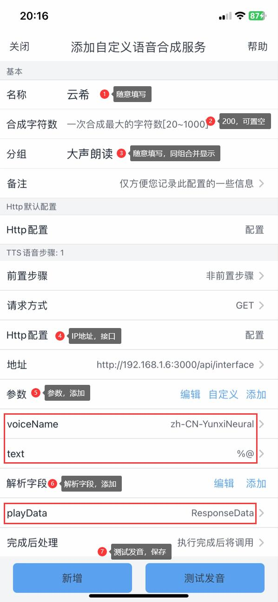
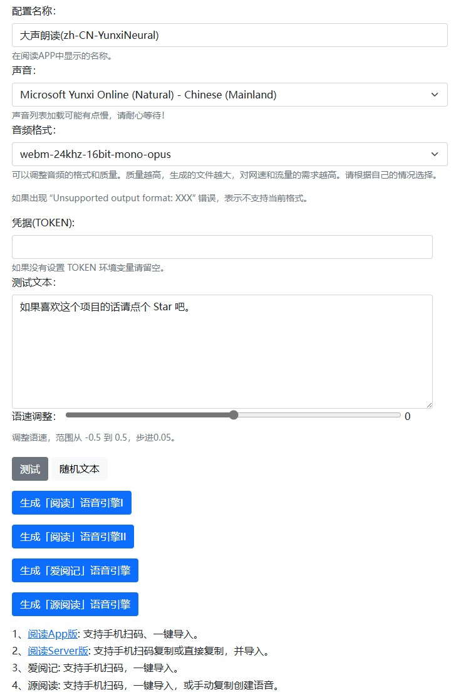

# 大声朗读


<br />

## 简介
一个简单的文本转语音服务，支持微软的TTS服务，用于阅读类软件语音朗读，如阅读、爱阅书香、爱阅记、源阅读等。


<br />

## 部署


### docker

```bash
docker run -d \
  --name TTS \
  -p 3000:3000 \
  --restart unless-stopped \
  -e TOKEN=example \ #可选
  libntdll/ms-tts:latest
```


### docker compose

```yaml
version: '3'

services:
  TTS:
    container_name: TTS
    image: libntdll/ms-tts:latest
    restart: unless-stopped
    ports:
      - "3000:3000"
    # 如果可以保持自己的ip或者完整域名不公开的话，可以不用设置环境变量
    environment: []
    #需要的话把上边一行注释，下面两行取消注释
    #environment: 
    #  - TOKEN=自定义TOKEN
```


<br />

## 爱阅书香配置：

打开ios爱阅书香App -> 右滑进入听书配置 -> 自定义语音库 -> 创建 -> 高级自定义语音合成

| 选项        | 添加项    | 添加值                          | 备注                                                                                                                                            |
| ----------- | --------- | ------------------------------- | ----------------------------------------------------------------------------------------------------------------------------------------------- |
| 名称        |           |                                 | 随意                                                                                                                                            |
| 分组        |           |                                 | 随意，相同分组名分组在一起显示                                                                                                                  |
| TTS语音步骤 |           |                                 |                                                                                                                                                 |
| 地址        |           | http://192.168.1.6:3000/api/tts | ip地址、端口根据实际情况修改                                                                                                                    |
| 参数        | voiceName | zh-CN-YunxiNeural               | zh-CN-XiaoxiaoNeural<br />zh-CN-XiaoyiNeural<br />zh-CN-YunjianNeural<br />zh-CN-YunxiNeural<br />zh-CN-YunxiaNeural<br />zh-CN-YunyangNeural等 |
| 参数        | text      | %@                              |                                                                                                                                                 |
| 解析字段    | playData  | ResponseData                    |                                                                                                                                                 |




<br />

## 文本转语音文档


[文本转语音文档 - 参考](https://learn.microsoft.com/zh-cn/azure/ai-services/speech-service/index-text-to-speech)

[通过语音合成标记语言 (SSML)改进合成](https://learn.microsoft.com/zh-cn/azure/ai-services/speech-service/speech-synthesis-markup)





